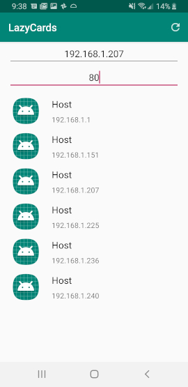

# LazyCards

An Android app that creates vocabulary flash cards for you! No need to 
create a list of words to look up, waste time copy/pasting definitions, antonyms, whatever
into Anki. Just enter your word, select the deck Anki Deck you want to upload to, select 
what you'd like to include in your definition, and submit it away.

## REQUIREMENTS

* [Anki](https://apps.ankiweb.net/) installed on a Linux/Windows/MacOS desktop
* [AnkiConnect](https://ankiweb.net/shared/info/2055492159), an addon for Anki
* [LazyCards Server](https://github.com/salabon77mk/lazycards_server)
* Android device (for the app!)

## First Time Use

Clone this repository and import it into Android Studio as a project. From there, connect your phone and hit run.
The app is now installed.

(Temporary) On the homescreen, press the NET\_SCAN button, and either select a device or input the
IP address of the device that is hosting the LazyCards Server.

## APIs currently supported

[WordsAPI](https://www.wordsapi.com/)

## DEMOS

### Submit Word Demo
1. Input a word
  

  

2. Select your deck
  

  

3. Choose the options you'd like to include as part of your flashcard
  

  

4. Submit your word!
  

  

5. Check out Anki. A new word!
  

  

6. Here's the definition with the options you selected. Looks like the API couldn't find antonyms
for taste
  

  

---

### Network Scanner Demo
1. The scan just started!
  

  

2. Getting some results
  

  

3. Scan complete and results sorted via Key-Index sort
  

  

4. Select your host and your port optionally as well too!
  

  
