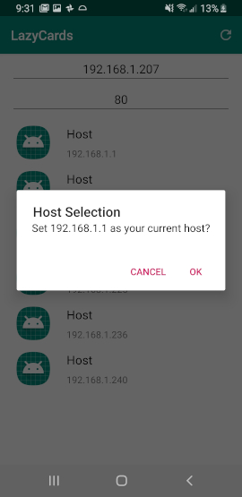

# LazyCards

An Android app that creates vocabulary flash cards for you! No need to 
create a list of words to look up, waste time copy/pasting definitions, antonyms, whatever
into Anki. Just enter your word, select the deck Anki Deck you want to upload to, select 
what you'd like to include in your definition, and submit it away.

## REQUIREMENTS

* [Anki](https://apps.ankiweb.net/) installed on a Linux/Windows/MacOS desktop
* [AnkiConnect](https://ankiweb.net/shared/info/2055492159), an addon for Anki
* [LazyCards Server](https://github.com/salabon77mk/lazycards_server)
* Android device (for the app!)

## First Time Use

Clone this repository and import it into Android Studio as a project. From there, connect your phone and hit run.
The app is now installed.

Press the navigation icon at the top left, click Network Scanner, and either wait for the scan
to complete and select a device or input the IP address and port of the LazyCards Server.

## APIs currently supported

[WordsAPI](https://www.wordsapi.com/)

## DEMOS

### Submit Word Demo
1. Input a word. The first text box is the front of the card. The second is your own note for the back.
  

  

2. Select your deck
  

  

3. Select the API you would like to use
  

  

4. Choose the options you'd like to include as part of your flashcard
  

  

5. Submit your word! 
  

  

6. Check out Anki. A new word!
  

  

7. Here's the definition with the options you selected. Looks like the API couldn't find antonyms
for taste
  

  

---

### Queue Demo, What happens when you're away from home and have a bunch of new cards to send?

1. After filling out the details of your word, check "Send to queue instead" and hit "Submit"
  

  

2. After sending some cards to the queue, click on the navigation icon at the top left and select
"Queued"
  

  

3. A queue with some cards waiting to be sent to Anki
  

  

4. Hit the submit button and watch the cards get sent away! The below image is once all cards 
are sent.
  

  

5. Three new cards have appeared!
  

  

6. Here they are in Anki's card browser
  

  

---
### Network Scanner Demo
1. Navigate to the Network Scanner
  

  

2. The scan just started!
  

  

3. Getting some results
  

  

4. Scan complete and results sorted via Key-Index sort
  

  

5. Select your host and your port optionally as well too!
  

  
